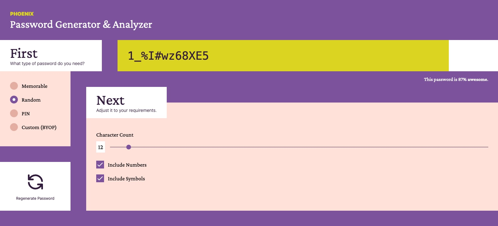
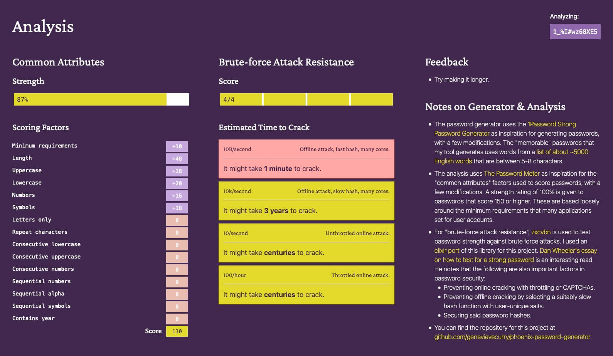

# Deluxe Phoenix Password Generator & Analyzer

The password generator uses the [1Password Strong Password Generator](https://1password.com/password-generator/) as inspiration for generating passwords, with a few modifications. The "memorable" passwords that my tool generates uses words from a [list of about ~5000 English words](https://github.com/first20hours/google-10000-english/blob/master/google-10000-english-usa-no-swears-medium.txt) that are between 5-8 characters.

The analysis uses [The Password Meter](http://www.passwordmeter.com/) as inspiration for the "common attributes" factors used to score passwords, with a few modifications. A strength rating of 100% is given to passwords that score 150 or higher. These are based loosely around the minimum requirements that many applications set for user accounts.

For "brute-force attack resistance", [zxcvbn](https://github.com/dropbox/zxcvbn) is used to test password strength against brute force attacks. I used an [elixir port](https://github.com/techgaun/zxcvbn-elixir) of this library for this project. [Dan Wheeler's essay on how to test for a strong password](https://dropbox.tech/security/zxcvbn-realistic-password-strength-estimation) is an interesting read. He notes that the following are also important factors in password security:

- Preventing online cracking with throttling or CAPTCHAs.
- Preventing offline cracking by selecting a suitably slow hash function with user-unique salts.
- Securing said password hashes.

## Live Demo on Fly.io

[https://phoenix-password-generator.fly.dev/](https://phoenix-password-generator.fly.dev/)

## Screenshots

## To start your Phoenix server:

- Install dependencies with `mix deps.get`
- Install Node.js dependencies with `npm install` inside the `assets` directory
- Start Phoenix endpoint with `mix phx.server`

Now you can visit [`localhost:4000`](http://localhost:4000) from your browser.

## Manually Deploying to Fly.io

`fly deploy`

If you don't have the Fly.io CLI installed, see the next section for more information.

### Fly.io Setup

You will need to install [`flyctl`](https://fly.io/docs/hands-on/install-flyctl/) in order to manually deploy to Fly.io.

After installing their CLI, use `fly auth signup` to sign up for an account with your GitHub credentials.

Run `fly ssh issue --agent` to setup SSH for Fly.io.

**Deploy Command**

`fly deploy`

**SSH into Remote App IEx shell**

`fly ssh console -C "app/bin/stubs remote"`

## Learn more

- Official website: https://www.phoenixframework.org/
- Guides: https://hexdocs.pm/phoenix/overview.html
- Docs: https://hexdocs.pm/phoenix
- Forum: https://elixirforum.com/c/phoenix-forum
- Source: https://github.com/phoenixframework/phoenix
